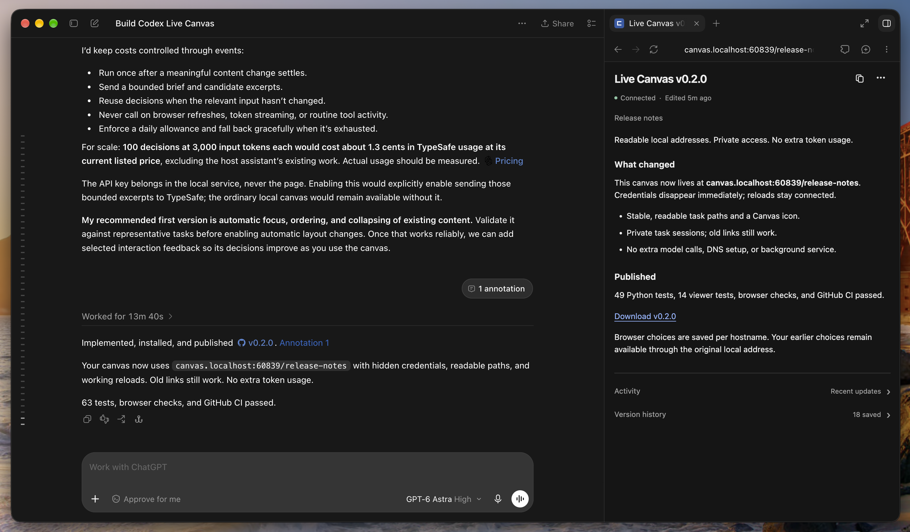

# Live Canvas

A small, local workspace beside your AI conversation. Keep the actual work visible: an outline, evidence, decisions, study questions, edit beats, or a diagram. The assistant updates authored sections at meaningful milestones; lightweight local adapters bring in activity and visible responses automatically.

Python standard library only. No API keys, packages, hosted service, or background model calls. The viewer has light and dark themes, six flexible content blocks, and useful browser-local interactions. It never writes back to the assistant or runtime.



## Supported clients

| Client | Automatic observations | Viewer |
| --- | --- | --- |
| Codex | SessionStart instruction plus registered local transcript | Right-hand Codex browser panel on the first user turn |
| Claude Code | Command hooks: generic activity and the final visible response on `Stop` | OS browser automatically at foreground session startup |
| Cursor | Command hooks: generic activity and `afterAgentResponse` text | Built-in browser on the first user turn when exposed; otherwise OS browser |

This package targets local macOS and Linux environments with Python 3.9+. Windows is not supported by the runtime's file-locking implementation. Ordinary Claude chat has no native integration. Remote environments need their own installation and access to the loopback viewer.

## Quick start

```sh
git clone https://github.com/mhadifilms/live-canvas.git
cd live-canvas
```

Preview the changes, install, and verify configuration:

```sh
python3 session-canvas/install_clients.py dry-run
python3 session-canvas/install_clients.py install
python3 session-canvas/install_clients.py check
```

The default installs all three clients. Add `--client codex`, `--client claude`, or `--client cursor` to target one (`--client both` retains Claude Code + Cursor compatibility). The installer merges user hooks, backs up changed settings, and installs a `live-canvas` skill. It preserves unrelated hooks and existing `canvas` skills, and refuses conflicting files. Cloning this repository alone changes no client configuration.

For Codex, enable the host's hooks feature if needed with `codex features enable hooks`; the installer preserves `config.toml` and existing guard hooks. Restart the client if necessary, then start a new foreground chat. **The canvas opens automatically:** Claude Code dispatches a local browser worker at startup; Codex and Cursor receive an instruction to open their panel on the first user turn. Clicking a blank new-chat button alone cannot open a native panel through these hooks. Session context supplies the exact identity; no manual lookup or extra model turn is needed.

Resume, clear, compact, and fork events do not trigger automatic opening. Background/subagent/noninteractive sessions are skipped when the payload identifies them; hosts do not always expose those indicators. Per-session claims suppress repeated openings, and explicit `stop` remains stopped. Opening failures are retryable; after an interrupted attempt, a claim expires after five minutes. A crash between opening a UI and acknowledgement can cause a later retry to open it again.

Codex may ask you to review and trust a newly installed hook through its normal approval prompt. The installer does not bypass hook trust.

Keep this checkout in place because the installed hooks and skill reference it. To move an installation, uninstall from the original checkout first. You can still ask **“open live canvas”** or invoke `/live-canvas` for manual use.

Turn automatic opening off or on for all clients using this state directory:

```sh
python3 session-canvas/canvas.py auto-open off
python3 session-canvas/canvas.py auto-open on
```

For skill-only Codex use without automatic opening, create a link from the repository root. This refuses to replace an existing path:

```sh
skill_path="${CODEX_HOME:-$HOME/.codex}/skills/live-canvas"
if [ -e "$skill_path" ] || [ -L "$skill_path" ]; then
  printf 'Already exists; inspect before changing: %s\n' "$skill_path"
else
  mkdir -p "$(dirname "$skill_path")"
  ln -s "$PWD/live-canvas" "$skill_path"
fi
```

Open a new Codex task and ask to use the `live-canvas` skill. Automatic transcript discovery requires a local session and `CODEX_THREAD_ID`; the skill documents explicit updates when a transcript is unavailable.

Try a fictional example without installing any hooks:

```sh
python3 session-canvas/canvas.py start --thread example-preview
python3 session-canvas/canvas.py update --thread example-preview --file session-canvas/examples/study.json
```

Open the returned URL. Use `stop --thread example-preview` to disable that example or `shutdown` to stop the shared server.

## How it stays useful

Authored sections support text, lists, checklists, tables, recall cards, and timelines, plus optional isolated HTML/SVG visuals. Check off personal review items, practice with Again / Got it, or shortlist candidate ideas and copy your choices. These interactions persist in your browser, synchronize between views of the same task, reset when their content changes, and never imply assistant-verified results. Existing browser choices migrate automatically; a shared reset clears them across views. A compact header separates connection status from authored freshness; bounded activity and readable version history stay collapsed until needed. Stable section IDs let the assistant update only what changed. A new context clears stale authored content and retains revision history.

Automatic observations never infer a plan, completion, scores, or semantic adaptation. Claude Code and Cursor deliver response text at message boundaries, not token by token. The assistant must still update useful sections at milestones and before its final reply. A bounded `status --summary` digest keeps that work inexpensive.

State stays on disk in `session-canvas/.state` by default. The viewer opens at a readable address such as `http://canvas.localhost:60839/quiz-review`. Its initial private link contains a task credential in the fragment; the page immediately removes it and exchanges it for an HttpOnly cookie. Keep the initial link private; the clean address alone does not authorize another browser. Canvas content remains read-only over HTTP. This is not a security boundary against other processes running as the same OS user. Adapters exclude prompts, tool arguments/results, and reasoning. Codex transcript registration can import earlier visible assistant responses from that same session. Review canvas content before sharing it.

See the [runtime guide and schema](session-canvas/README.md), [skill instructions](live-canvas/SKILL.md), and [design notes](session-canvas/DESIGN.md).

## Uninstall and development

Remove the installed client integrations with:

```sh
python3 session-canvas/install_clients.py uninstall
```

It removes unchanged owned hooks and skill links while preserving unrelated edits, backups, and canvas state. Remove a Codex skill link only after confirming it points to this checkout.

Run the offline tests from the repository root:

```sh
python3 -m unittest discover -s session-canvas -v
node --test session-canvas/test_viewer.mjs
```

CI runs the Python suite on 3.10 and 3.12, plus dependency-free Node tests for viewer helpers. Node is needed only for those development tests, not to run the canvas. Host hook loading and browser behavior also need verification in the installed client; unit tests do not establish that a host has loaded the integration.

Inspired by [sebi75/herdr-canvas](https://github.com/sebi75/herdr-canvas). Live Canvas does not require Herdr. Licensed under [MIT](LICENSE).

Readable routes stay fixed after their first opening, even when the title changes. Duplicate names receive a short task suffix. Chromium-based host panels support `canvas.localhost`; the external-browser startup helper defaults to `localhost`. If your browser cannot resolve the branded name, set `LIVE_CANVAS_HOST=localhost` (or `127.0.0.1`) when running the command that returns the URL. No hosts-file edits are needed. Cookies and browser-only choices belong to each origin: old capability links still open and clean themselves on their original origin, preserving choices there; switching hostname or port does not migrate those choices. After upgrading a running installation, run `shutdown` and then `start` to load the new server code.
